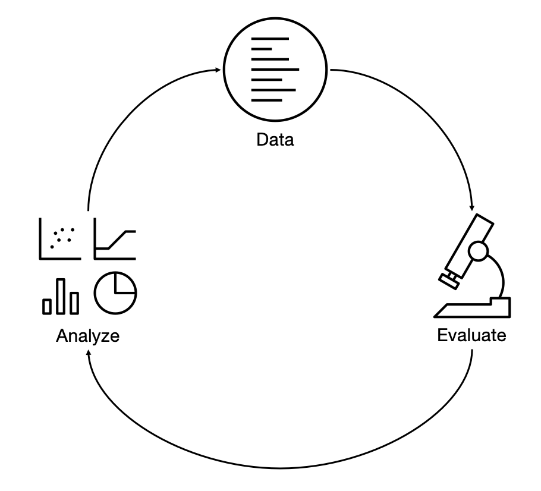

# RAGaphene

A web application for building, evaluating, and analyzing Retrieval-Augmented Generation (RAG) systems, covering the full generative AI development lifecycle: **Data → Evaluate → Analyze**.



1. **Data** — Create and curate multi-turn conversations with SME annotation
2. **Evaluate** — Run RAG pipelines and LLM judges against curated datasets
3. **Analyze** — Export to [InspectorRAGet](https://github.com/IBM/InspectorRAGet) for performance benchmarking

## 🚀 Quick start

You need [Node.js](https://nodejs.org) ≥ 22.14.0. For a fully local demo, also install [Ollama](https://ollama.com) and pull a model (for example `ollama pull llama3.2`).

```shell
git clone https://github.com/IBM/RAGaphene && cd RAGaphene
npm install
npm run setup          # writes .env.local with a generated secret + demo login
npm run dev            # starts on http://localhost:3000
```

Then open [http://localhost:3000](http://localhost:3000) and:

1. Log in with the sample credentials (**username** `user`, **password** `RAGapheneUser`).
2. Go to **Data → Create**.
3. Under the retriever, pick **Local Documents** and upload a `.txt`, `.md`, or `.pdf` file.
4. Under the generator, pick **Ollama** (local, no key) — or paste an OpenAI/Anthropic API key.
5. Start a conversation grounded in your document.

No TLS, no external accounts, and no source edits are required for this path.

## ✨ Features

### Data

**Create**
- Multi-turn conversations with RAG (retriever + generator)
- Fix model responses to continue with a corrected history
- Rate retrieved passages and model responses
- Free-text passage search within a collection
- Add per-turn enrichments (question type, tonality, etc.)
- Export conversations to JSON

**Review**
- Accept/reject conversations created via the workbench
- Add inline comments on turns and passages

### Experiment
- Convert conversations to a next-response-prediction dataset
- Configure and run different RAG pipelines
- Run LLM judge evaluations and collect metrics

> [!NOTE]
> The Experiment stage runs a Python evaluator. It requires a Python environment
> with the dependencies in `scripts/requirements.txt`. See
> [Experiment setup](#experiment-python-setup) below. The Data stage has no
> Python dependency.

### Analyze
- Export experiment results in InspectorRAGet format with one click

## 🏛️ Architecture

**Tech stack:** Next.js 16 (App Router) · React 18 · IBM Carbon Design System · NextAuth.js · TypeScript 5.9 · Node.js ≥22

**Supported LLMs:** Ollama · OpenAI · Anthropic · Gemini · WatsonX.AI

**Data sources:** Local Documents (built-in) · Elasticsearch (ELSER) · MongoDB

The server side uses a connector/adapter pattern: all LLM and retriever providers implement a common interface, making it straightforward to add new ones.

See [docs/architecture.md](docs/architecture.md) for full technical details.

## 🔧 Configuration

System configuration lives in `src/config/system.ts`. It defines:
- **authenticator** — how users log in (see [Authentication](#authentication))
- **retrievers[]** — Local Documents, Elasticsearch, MongoDB connectors
- **generators[]** — LLM connectors with prompt templates, parameters, and supported modes
- **plugins[]** — enrichment values, GitHub issue reporter, etc.

Connectors with `credentials.provider: "server"` read API keys from environment
variables. Those with `"client"` prompt the user to supply a key in the browser
(stored encrypted in the NextAuth session cookie, never visible in the Network tab).

### Environment variables

`npm run setup` creates `.env.local` for you. To configure by hand, copy
`.env.example` to `.env.local` and edit it. The variables that matter for the
default local path are `NEXTAUTH_SECRET`, `AUTH_PROVIDER`, `AUTH_USERNAME`, and
`AUTH_PASSWORD`; everything else is optional.

## 🔐 Authentication

`AUTH_PROVIDER` selects how users log in:

| Value | Description |
|---|---|
| `credentials` (default) | Username/password. Set `AUTH_USERNAME` / `AUTH_PASSWORD`. No external identity provider. |
| `github` | GitHub OAuth. See below. |
| `oauth` | Generic OIDC. Point `AUTH_ISSUER` at any compliant provider; endpoints are auto-discovered. |

### GitHub OAuth

1. Create an OAuth app at [github.com/settings/developers](https://github.com/settings/developers)
   with callback URL `https://localhost:3000/api/auth/callback/github`.
2. Set in `.env.local`:
   ```
   AUTH_PROVIDER=github
   AUTH_CLIENT_ID=<client-id>
   AUTH_CLIENT_SECRET=<client-secret>
   NEXTAUTH_URL=https://localhost:3000
   ```
3. Run over HTTPS (OAuth redirects require it): `npm run dev:https`
   (see [HTTPS for local OAuth](#https-for-local-oauth)).

### Generic OIDC

Set `AUTH_PROVIDER=oauth`, `AUTH_ISSUER=<issuer-base-url>`, and
`AUTH_CLIENT_ID` / `AUTH_CLIENT_SECRET`. The provider's
`.well-known/openid-configuration` supplies every endpoint. Use
`AUTH_WELL_KNOWN` directly if the discovery URL is non-standard, and
`AUTH_PROVIDER_NAME` to set the sign-in button label.

## 🧩 Advanced setup

### Production / hosted LLMs and retrievers

Beyond the local defaults, RAGaphene can connect to hosted services. Set the
relevant environment variables in `.env.local` (see `.env.example` for the full
list):

- **OpenAI / Anthropic / Gemini** — set the corresponding `*_API_KEY`, or leave
  unset to have users paste a key in the browser.
- **WatsonX.AI** — set `WATSONX_API_KEY` and `WATSONX_PROJECT_ID`.
- **Elasticsearch** — set `ES_ENDPOINT` and either `ES_API_KEY` or
  `ES_USERNAME` / `ES_PASSWORD`.

### <a id="experiment-python-setup"></a>Experiment (Python) setup

The Experiment stage shells out to `scripts/evaluator.py`. Create a virtual
environment outside the repo root (a venv symlinked inside the project directory
can break the build), install the dependencies, and point `.env.local` at it:

```shell
python3 -m venv ~/ragaphene-venv
~/ragaphene-venv/bin/pip install -r scripts/requirements.txt
```

```
PYTHON_ENVIRONMENT_PATH=/Users/you/ragaphene-venv
```

If the evaluator's environment is missing, the Experiment stage returns a clear
error rather than failing silently.

### <a id="https-for-local-oauth"></a>HTTPS for local OAuth

OAuth providers redirect back over HTTPS, so local OAuth needs a TLS proxy.
Generate a locally-trusted certificate with [mkcert](https://github.com/FiloSottile/mkcert):

```shell
mkdir keys && cd keys && mkcert localhost    # brew install mkcert first on macOS
```

Then set `NEXTAUTH_URL=https://localhost:3000` and run:

```shell
npm run dev:https      # HTTPS proxy on :3000 → Next.js on :3001
```

### Issue reporting

The in-app "Report conversation" feature can open a GitHub issue. Set
`GITHUB_TOKEN` and `GITHUB_REPO` (as `owner/name`); set `GITHUB_API_URL` for a
GitHub Enterprise instance. Set `NEXT_PUBLIC_GITHUB_REPO_URL` so the client can
link to the repo's issues page.

## 🏗️ Build & test

```shell
npm run build             # production build
npm run start             # serve the production build on :3000
npm test                  # run all tests (Jest)
npm run test:coverage     # with coverage report
```

## 📄 License

Copyright IBM Corp. 2023 - 2026

Distributed under the Apache-2.0 License. See [LICENSE](LICENSE).

## 🥁 Acknowledgements

Thanks to the [Carbon Design System](https://github.com/carbon-design-system/carbon) team.
